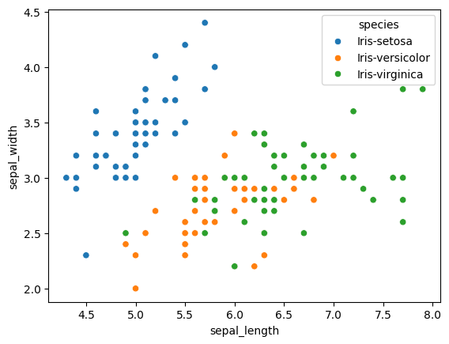

# Iris Flower Classification Case Study

## 1. Problem Statement
Iris flower classification is a well known case study to all of us, it is almost used by everyone who want's to and is starting to learn machine learning.We can also call it as "Hello World" of Machine Learning.
It's a simple and clear case study wherein we have to classify samples of flowers into its category. Iris has 3 sub categories as Iris-Setosa, Iris-Virginica and Iris-Versicolor.


## 2. Dataset

- We're using the dataset provided by sklearn library using the `load_iris()` function. A example .csv file is also provided [here](/data/iris.csv).
- The dataset contains 150 records of flowers each category consisting of 50 samples.
- Each record in the dataset consists of 4 primary features to be considered for our case study, which are as follows :
1. Sepal length
2. Sepal width
3. Petal length
4. Petal width
(All in centimeters)

Sample of dataset:

| Sepal length | Sepal width | Petal length | Petal width | Class |
|--------------|-------------|--------------|-------------|-------|
|5.1|3.5|1.4|0.2|Iris-setosa|
|4.9|3.0|1.4|0.2|Iris-setosa|
|5.6|2.9|3.6|1.3|Iris-versicolor|
|6.7|3.1|4.4|1.4|Iris-versicolor|
|6.2|3.4|5.4|2.3|Iris-virginica|
|5.9|3.0|5.1|1.8|Iris-virginica|


**Feature encoding** :

Here feature encoding is not required as the features are already in numeric form.

**Label encoding** :

We have 3 main species, so 3 labels can be given as follows :
1. Iris-setosa : 0
2. Iris-versicolor : 1
3. Iris-virginica : 2


Some EDA conducted at basic level helped us to figure out that : 

The range of calculated lengths and widths are as follows : ( min -> max ) : 

|    | sepal_length | sepal_width | petal_length | petal_width |
|----|--------------|-------------|--------------|-------------|
|Iris-setosa| 4.3 -> 5.8 | 2.3 -> 4.4 | 1.0 -> 1.9 | 0.1 -> 0.6 |
|Iris_versicolor| 4.9  ->  6.9 | 2.0  ->  3.4 | 3.0  ->  5.1 | 1.0  ->  1.8 |
|Iris-virginica| 4.9  ->  7.9 | 2.2  ->  3.8 | 4.5  ->  6.9 | 1.4  ->  2.5 |

The same plotted on a scatterplot looked like this :

1. Comparing Sepal length and width :


From the above plot, we can infer that - 
- Species Setosa has smaller sepal lengths but larger sepal widths.
- Versicolor Species lies in the middle of the other two species in terms of sepal length and width
- Species Virginica has larger sepal lengths but smaller sepal widths.


2. Comparing Petal length and width :


From the above plot, we can infer that - 

- Species Setosa has smaller petal lengths and widths.
- Versicolor Species lies in the middle of the other two species in terms of petal length and width
- Species Virginica has the largest of petal lengths and widths.


We can see there is a huge overlapping in sepal length and width for species versicolor and species virginica.

We can either use only petal length and width for our classification or use both sepal and petal lengths and widths.

**All above EDA is conducted [here](iris_eda.py).**


## 3. Approach

We are going to use Decision Tree Classifier from sklearn library, to classify the samples in our dataset to their respective classes.

- Features sepal_length, sepal_width, petal_length, petal_width are used to **train the model**.
- Labels have three types 0,1,2 (after encoding).


**What other features of flower exists?**

Non-morphological features : (except lengths, area, widhts)
- Color : RGB values
- Soil type : ph, fertility of soil
- Humidity : moisture in air during growth
- Temperature : growing conditions of the plant.

We will focus on the most discriminative features like petal and sepal length and width, along with useful derived features like ratios and areas(optional not included in our code). Environmental, genetic, and metadata features are either irrelevant or could introduce noise, so let's exclude them.


## 4. Model Training
**Training and Testing dataset splitting**

We've used the `train_test_split()` method from the `sklearn.model_selection` module.

We're splitting the dataset with test_size = 0.5 that is 50% of data is used for training and 50% is used for testing.

```python 
    data_train, data_test, target_train, target_test = train_test_split(features, labels, test_size = 0.5)
    
    obj = tree.DecisionTreeClassifier()
    
    obj = obj.fit(data_train, target_train)
```

We have used the `graphviz` module from python to visualize the learning tree.


## 5. How to execute

- Make sure **Python** and the **scikit-learn** and **graphviz** library are installed.  
  You can install scikit-learn using:
  ```bash
  pip install scikit-learn
  pip install graphviz

- Run the program using:
    ```bash
    python iris_classification_4.py

## 6. Conclusion
- This case study demonstrates how a Decision Tree Classifier can be used to learn patterns from data (training) and predict the class (species) of new samples (classification).

- It provides a clear understanding of how machine learning models make decisions based on feature values such as sepal length, sepal width, petal length, and petal width.

- The Iris Flower Classification problem serves as a classic and foundational example for understanding classification tasks in machine learning.

- Though it is a simple and well-known dataset, it effectively illustrates key concepts like data preprocessing, model training, visualization, and evaluation.

- This case study is mainly intended for educational and learning purposes to understand how classification algorithms like Decision Trees operate.
